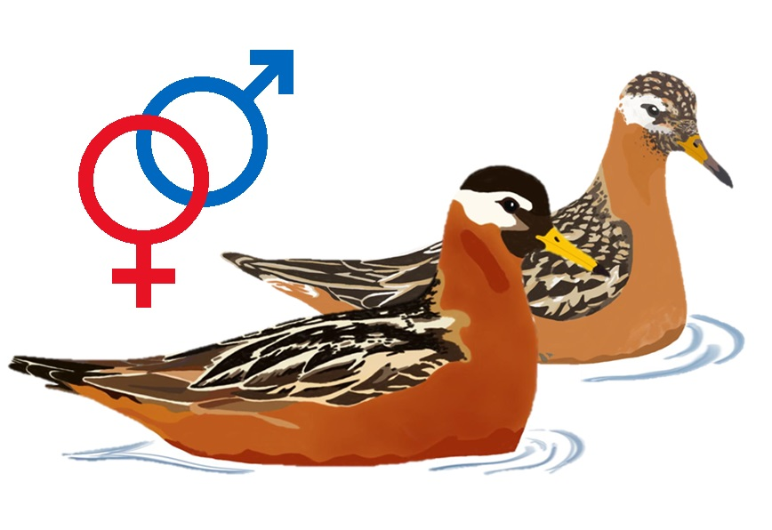

# **Data and code from:**

### Extra-pair paternity in a sequentially polyandrous shorebird: limited evidence for the sperm-storage hypothesis

  

  

A pair of red phalaropes (_Phalaropus fulicarius_). Illustration by Margherita Cragnolini.

### **Description**

This repository contains all data and code used for data analysis and figure production in "*Extra-pair paternity in a sequentially polyandrous shorebird: limited evidence for the sperm-storage hypothesis*" by 
Johannes Krietsch , 
Margherita Cragnolini, 
Sylvia Kuhn, 
Richard B. Lanctot ,
Sarah T. Saalfeld, 
Mihai Valcu  and 
Bart Kempenaers .  
  
When using the data or code please cite the associated manuscript (in review) and [Open Science Framework repository](https://osf.io/v475t/) (which is synchronized with this repository). Please do not hesitate to contact me (j.krietsch@orn.mpg.de) if you have any questions, trouble running the code, found bugs or ideas to develop the project further. 

&nbsp;

### **Repository Contents**

**`DATA/`**:

All data used in this analysis (click on the black arrows to see column definitions). Extracted from our database 
and from [Dale et al. 1999 - Figure 1](https://doi.org/10.1007/s002650050591)

  
 <b><code>CAPTURES</code></b> – a table of all captures data

  
  Columns are defined as:

  1.	`external`: source of the data, MPIO = 0 or USFWS = 1
  2.	`data_type`: data types (see methods)
  3.	`year_`: year
  4.	`ID`: metal band id
  5.	`UL`: upper left colour bands
  6.	`UR`: upper right colour bands
  7.	`LL`: lower left colour bands
  8.	`LR`: lower right colour bands
  9.	`sex`: field and genetic sex
  10. `lat`: capture location latitude (decimal degrees)
  11. `lon`: capture location longitude (decimal degrees)
  12. `caught_time`: date and time caught
  13. `dead`: bird was found dead = 1 or was caught alive = 0

  
 <b><code>NESTS</code></b> – a table of all nests data

  
  Columns are defined as:

  1.	`external`: source of the data, MPIO = 0 or USFWS = 1
  2.	`data_type`: data types (see methods)
  3.	`year_`: year
  4.	`nestID`: unique nest id
  5.	`male_id`: male metal band id
  6.	`female_id`: female metal band id
  7.	`male_assigned`: how the male was assigned: 0 = not, 1 = field, 2 = genetically, 3 = only GPStag
  8.	`female_assigned`: how the female was assigned: 0 = not, 1 = field, 2 = genetically, 3 = only GPStag
  9.	`found_datetime`: date and time the nest was found
  10. `clutch_size`: total clutch size
  11. `collected_datetime`: date and time the clutch was collected (if so)
  12. `initiation`: estimated date and time the first egg was laid
  13. `initiation_method`: method with which the initiation date was estimated
  14. `est_hatching_datetime`: estimated hatching date and time 
  15. `hatching_datetime`: method with which the hatching date was estimated
  16. `chicks_back`: date and time chicks were brought back to the nest
  17. `last_checked_datetime`: date and time the nest was checked for the last time
  18. `nest_state`: last nest state: I = Incubated (active  nest), P = Predated, D = Deserted, H = Hatched (received hatched chicks), 
                    U = Unknown, O = Observer (collected withour replacement)     
  19. `nest_state_date`: date and time the nest state was based on 
  20. `lat`: nest location latitude (decimal degrees)
  21. `lon`: nest location longitude (decimal degrees)
  22. `parentage`: logic if parentage was possible     
  23. `anyEPY`: logic if any extra-pair young were found in the clutch
  24. `N_parentage`: number of eggs with parentage data
  25. `N_EPY`: number of extra-pair young
  26. `female_clutch`: sequence of female clutches based on the initiation date (1st, 2nd or 3rd clutch) within season
  27. `N_female_clutch`: total number of clutches within season
  28. `polyandrous`: logic if the female was social polyandrous
  29. `polyandry_study_site`: logic if the female was social polyandrous with both clutches within the intensive study plot
  30. `male_clutch`: sequence of male clutches based on the initiation date (1st or 2nd clutch) within season   
  31. `N_male_clutch`: total number of clutches within season     
  32. `renesting_male`: logic if the male was renesting
  33. `renesting_study_site`: logic if the male was renesting with both clutches within the intensive study plot

  
 <b><code>OBSERVATIONS</code></b> – a table of all observations data

  
  Columns are defined as:

  1.	`year_`: year 
  2.	`datetime_`: date and time of the observation
  3.	`obs_id`: unique observation id
  4.	`ID1`: id of one bird
  5.	`ID2`: id of another bird (if interaction)
  6.	`ID1sex`: sex of ID1
  7.	`ID2sex`: sex of ID2
  8.	`ID1copAS`: ID1 was copulating = 1 or not = 0
  9.	`ID2copAS`: ID2 was copulating = 1 or not = 0
  10. `same_sex`: logic ID1 and ID2 have the same sex
  11. `ID1_1st_partner`: id of the first breeding partner of ID1
  12. `ID1_2nd_partner`: id of the second breeding partner of ID1
  13. `diff_obs_1st_initiation`: differences between the observation and the initiation of the first nest
  14. `diff_obs_2nd_initiation`: differences between the observation and the initiation of the second nest
  15. `seen_with_other_than_1st_partner`: logic observation with other than first partner
  16. `seen_with_other_than_2nd_partner`: logic observation with other than second partner
  17. `copAS_not_1st_partner`: logic copulation with other than first partner
  18. `copAS_not_2nd_partner`: logic copulation with other than second partner     

  
 <b><code>PATERNITY</code></b> – a table of all paternity data

  
  Columns are defined as:

  1.	`year_`: year
  2.	`nestID`: unique nest id
  3.	`IDchick`: unique chick id
  4.	`IDmother`: genetic mother id
  5.	`IDfather`: genetic father id
  6.	`EPY`: extra-pair young = 1, within-pair young = 0 or unknown = NA
  7.	`fate`: egg fate, h = hatched, f = frozen (unidentified fate), u = unhatched
  8.	`undeveloped`: egg where only the germinal disc was visible = 1 or developed egg = 0
  9.	`comment`: comment from the parentage analysis

  
 <b><code>Dale_et_al_1999_REPH_EPP</code></b> – a table with extra-pair paternity 
  from Dale et al. 1999 

  
  Columns are defined as:

  1.	`year_`: year
  2.	`nestID`: unique nest number
  3.	`initiation_doy`: day of the year the first egg was laid
  4.	`anyEPY`: nest with extra-pair young = 1 or without = 0

&nbsp;

**`R/`**:

  - [`2_R_script_data_anaylsis.R`](https://github.com/krietsch/REPH_PATERNITY/blob/master/R/2_R_script_data_anaylsis.R). 
  The main script to reproduce all analysis and figures of this project. It contains a detailed commented workflow and 
  follows the order in the manuscript. Each main block of the script can be run independently. 
  ([view in browser](https://raw.githack.com/krietsch/REPH_PATERNITY/master/OUTPUTS/2_R_script_data_anaylsis.html "html"))
  
  - [`0_functions.R`](https://github.com/krietsch/REPH_PATERNITY/blob/master/R/0_functions.R) The workflow script 
  sources this script, which is only needed to create a base map using OpenStreetMap data stored in the R package 
  [`auksRuak`](https://github.com/krietsch/auksRuak). 
  
  - [`1_extract_data_from_database.R`](https://github.com/krietsch/REPH_PATERNITY/blob/master/R/1_extract_data_from_database.R) 
  Contains the script which with the data were extracted from our database. This script can only be run with access 
  to our database and is only stored to document the process. 
  

&nbsp;

  
**`OUTPUTS/`**:

  - `2_R_script_data_anaylsis.html` – a compiled interactive html output of the workflow 
  ([view in browser](https://raw.githack.com/krietsch/REPH_PATERNITY/master/OUTPUTS/2_R_script_data_anaylsis.html "html"))
  
  - `FIGURES/` – contains all figures created for publication
  
  - `TABLES/` – contains all tables created for publication
  

&nbsp;

### **Terms of Use**

The data and code are supplied for scientific analysis, research, teaching or conservation purposes and shall be used only in accordance with the [GNU GPLv3](https://github.com/krietsch/REPH_PATERNITY/blob/master/LICENSE) license.
For any publication making substantial use of the data or code, the authors welcome the opportunity for collaboration and to comment prior to publication. Please reach out to me (j.krietsch@orn.mpg.de) or Bart Kempenaers (b.kempenaers@orn.mpg.de).

&nbsp;

### **Acknowledgments**

This work was funded by the [Max Planck Society](https://www.mpg.de/en) (to B.K.) and the [U.S. Fish and Wildlife Service](https://www.fws.gov/) (to R.L.). J.K. was supported by the International Max Planck Research School for Organismal Biology. 

We thank Alice Pintaric, Andrea Wittenzellner, Anne Cillard, Carol Gilsenan, Eunbi Kwon, Giulia Bambini, Kim Teltscher, Kristina Beck, Luisana Carballo, Martin Bulla, Peter Santema, Pietro D'Amelio, Sabine Spehn and Fenja Squirrell of the MPIO and Audrey Taylor, Ben Lagassé, Greg Norwood, Jen Selvidge, Jenny Cunningham, Jillian Cosgrove, Kirsten Grond, Lindall Kidd, Patrick Herzog, Willow English and Wyatt Egelhoff of the USFWS for help in the field. We also thank the state and federal committees that reviewed and approved permits for this study, and the Ukpeaġvik Iñupiat Corporation for logistic support and access to their lands. 

&nbsp;

  
     

